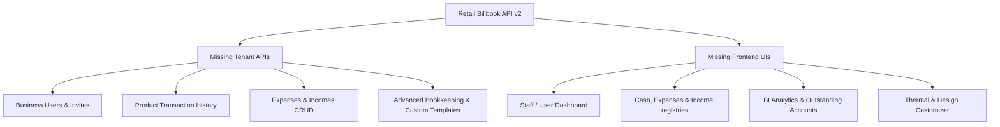

# Plan for v2 API & UI Compliance Auditing

This plan document presents a meticulous discrepancy analysis comparing the current codebase implementation against the **Retail Billbook — API Reference v2** specifications. It identifies every missing backend endpoint connector, missing front-end UI view, and lists the steps to achieve 100% v2 compliance.

***

## Discrepancy Matrix: Missing APIs vs. Missing UIs

Below is the structured breakdown of the missing elements mapped out by API Module from [retail_billbook_api_v2.md](file:///Users/bizbytech/Bizbytech/fullstack/SimpleBill/simple-bill/retail_billbook_api_v2.md).

---

## 1. Module 4 — Business Users & Staffing

*   **Missing API Connectors (`dataService.ts`)**:
    *   `GET /b/:businessId/users` — Fetch active members.
    *   `POST /b/:businessId/users/invite` — Invite user via `{ phone, role }`.
    *   `PUT /b/:businessId/users/:userId/role` — Update user's permission level.
    *   `PUT /b/:businessId/users/:userId/toggle-active` — Enable or suspend user account.
    *   `DELETE /b/:businessId/users/:userId` — Revoke business access.
*   **Missing UI Pages / Components**:
    *   **"Staff / Access Management" Screen**: A dedicated panel in Settings or standalone view to list active users, display pending invitation links, edit roles (Owner, Admin, Manager, Accountant, Staff), and toggle user access logs.

---

## 2. Module 7 & 8 — Category & Unit Masters (Dedicated CRUD)

*   **Missing API Connectors (`dataService.ts`)**:
    *   `GET /categories/:id`, `POST /categories`, `PUT /categories/:id`, `DELETE /categories/:id`.
    *   `GET /units/:id`, `POST /units`, `PUT /units/:id`, `DELETE /units/:id`.
*   **Missing UI Pages / Components**:
    *   **"Master Configuration Setup" Screen**: Dedicated standalone view or tab in Settings to CRUD categories and unit measurements (currently they are only managed implicitly or inline while editing products).

---

## 3. Module 9 — Products Master Enhancements

*   **Missing API Connectors (`dataService.ts`)**:
    *   `GET /products/:productId/purchase-history` — Log of all purchase bills containing this product.
    *   `GET /products/:productId/sales-history` — Log of all sales invoices containing this product with margins.
    *   `GET /products/:productId/purchase-return-history` — Log of product debit notes.
    *   `GET /products/:productId/sales-return-history` — Log of product credit notes.
    *   `POST /products/bulk-import` — Upload XLS/CSV bulk catalog.
    *   `GET /products/export` — Download catalog backups.
*   **Missing UI Pages / Components**:
    *   **"Product Analytics & Audit Log" Drawer**: Opened by clicking a product in the [Inventory.tsx](file:///Users/bizbytech/Bizbytech/fullstack/SimpleBill/simple-bill/pages/Inventory.tsx) list, rendering detailed transaction registries and history graphs.
    *   **"Excel Bulk Import / Export" Widget**: Accessible in the Inventory Dashboard.

---

## 4. Module 10 & 12 — Transaction details sub-routes

*   **Missing API Connectors (`dataService.ts`)**:
    *   `GET /purchases/:id/items` | `GET /purchases/:id/payments` | `GET /purchases/:id/returns`.
    *   `GET /sales/:id/items` | `GET /sales/:id/payments` | `GET /sales/:id/returns`.
*   **Missing UI Pages / Components**:
    *   **"Transaction Detail Drawer"**: Inside Invoices or Purchases registries, clicking a bill should open a detail pane showing the items list, connected partial payments, and processed returns rather than only rendering the print template.

---

## 5. Module 14 & 15 — Payment Query Filters

*   **Missing API Connectors (`dataService.ts`)**:
    *   `GET /payment-in?sale_id=...` — Fetch payments logged for a specific sale.
    *   `GET /payment-out?purchase_id=...` — Fetch payments logged for a specific purchase.
*   **Missing UI Pages / Components**:
    *   **"Linked Payments History" Widget**: Displayed within invoice details and inside [Payments.tsx](file:///Users/bizbytech/Bizbytech/fullstack/SimpleBill/simple-bill/pages/Payments.tsx) to isolate transactions matching a particular ledger.

---

## 6. Module 16 — Manual Day Book Records

*   **Missing API Connectors (`dataService.ts`)**:
    *   `POST /day-book` — Log manual cash inflow/outflow adjustments.
    *   `DELETE /day-book/:id` — Delete manual entries.
*   **Missing UI Pages / Components**:
    *   **"Record Cash Transaction" Form Modal**: In [Daybook.tsx](file:///Users/bizbytech/Bizbytech/fullstack/SimpleBill/simple-bill/pages/Daybook.tsx), allowing quick adjustment of physical vault/till counts without generating invoices.

---

## 7. Module 17, 18, 19, 20 — Cash, Expenses & Income Registries

*   **Missing API Connectors (`dataService.ts`)**:
    *   All category and entry CRUD APIs for both Expenses and Incomes (e.g. `POST /expenses`, `GET /expenses`, etc.).
*   **Missing UI Pages / Components**:
    *   **"Cashbook & Expenses" View**: A completely new navigation module to track operational costs (rent, salaries, office supplies) and other miscellaneous income. Includes list registries, categories setup, and entry logs.

---

## 8. Module 22 — BI Reports & Advanced Analytics

*   **Missing API Connectors (`dataService.ts`)**:
    *   `GET /reports/sales/fast-moving` — Item-wise velocity list.
    *   `GET /reports/sales/slow-moving` — Dead stock report.
    *   `GET /reports/sales/top-customers` — High value customers list.
    *   `GET /reports/gross-profit` — Margins.
*   **Missing UI Pages / Components**:
    *   **"Business Intelligence Center"** in [Reports.tsx](file:///Users/bizbytech/Bizbytech/fullstack/SimpleBill/simple-bill/pages/Reports.tsx): Visual dashboard featuring bar charts, tabular analytics lists, and stock velocity indicators.

---

## 9. Module 24 — Accounts (Bookkeeping Ledger & Search)

*   **Missing API Connectors (`dataService.ts`)**:
    *   `GET /accounts` — List consolidated balances.
    *   `GET /accounts/search` — 4-tile advanced payments query.
*   **Missing UI Pages / Components**:
    *   **"Accounts (Ledger Registry)" Dashboard**: Standalone bookkeeping workspace displaying aggregated outstanding lists ("You Will Give" vs "You Will Get") with an advanced multi-filter payment search form.

---

## 10. Module 25 & 26 — Invoice Printing Design Engine

*   **Missing API Connectors (`dataService.ts`)**:
    *   `GET /invoice-template` — Load active invoice design options.
    *   `PUT /invoice-template` — Save active configurations.
*   **Missing UI Pages / Components**:
    *   **"Invoice Design Editor" Screen**: Configurator panel allowing business administrators to toggle layout (A4 vs thermal 3-inch), customize colors, upload business logos, edit terms & conditions, and save bank details.

***

## Action Plan for next phase

1.  **Backend Controller Registration**: Ensure endpoints inside `backend/src/controllers` support the 44 missing endpoints.
2.  **dataService Mapping**: Add clean RESTful fetch mappings in [dataService.ts](file:///Users/bizbytech/Bizbytech/fullstack/SimpleBill/simple-bill/services/dataService.ts).
3.  **UI Construction**: Sequentially craft views for:
    *   *Accounts & Bookkeeping Ledger*
    *   *Cashbook, Incomes & Expenses*
    *   *Staff Invitation & Access suspending*
    *   *Invoice Template Design Editor*
