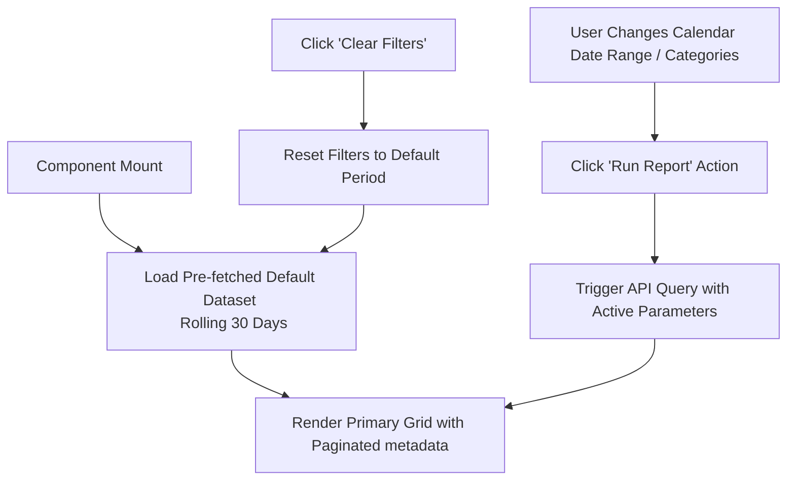

# Advanced Reports Panels (Module 22) — Implementation Specification
**Document Version:** 2.0.0 (Antigravity Engineering Reference)  
**Target System:** SimpleBill Indian Retail + Wholesale Billing Software (Model B Multi-Tenant)  
**Database Reference:** Schema v3 (`{tenant_prefix}_db`)  
**API Routing Reference:** API Spec v2  

---

## 1. Executive Summary & Design Aesthetics
To ensure a premium user experience, the **Advanced Reports Panels** must go beyond simple lists. The interface will feature high-fidelity visual elements, curating a beautiful and cohesive feel while ensuring data remains lightning fast.

### Premium Aesthetic Blueprint
*   **Palette & Themes:** A tailored high-contrast HSL color system optimized for both sleek Dark Mode (pitch black backgrounds with charcoal containers) and crisp Light Mode (warm white pages, clean borders). Primary indicators use vibrant emerald `#10b981` (profit/revenue), alert orange `#f59e0b` (low stock/deficit), and deep ocean blue `#3b82f6` (spent/purchases).
*   **Typography:** Strict sans-serif font pairing (e.g., *Inter* for administrative matrices, *Outfit* for premium bold headers and numerical KPI cards).
*   **Interactive Components:** Subtle border glow gradients, glassmorphism overlays (`backdrop-blur-md` on modals), and micro-animations (e.g., row elevation on hover, smooth spring drawer entries).
*   **No Placeholders:** Real-time populated data visualizations utilizing fully styled charts.

---

## 2. Global Performance & State Paradigms

To support dense per-tenant retail datasets efficiently, the UI and API follow a strict split-state approach:



### 1. Prefetched Default vs Active Execution
*   **Upon Initial Load:** The screen immediately displays the default dataset (pre-fetched rolling 30 days or general historical snapshots) to keep initial load times low.
*   **Execution:** Date inputs and classification dropdowns are bound locally. The report is re-executed only when the user clicks **Run Report** (for Fast Moving, Profitability, etc.) or **Generate Report** (for Dead Stock, Low Stock, etc.). Clicking **Clear Filters** resets inputs and returns the grid to the pre-fetched state.

### 2. Deterministic Server-Side Pagination
All reporting endpoints must leverage standardized server-side pagination with the following payload envelope:
```json
"pagination": {
  "page": 1,
  "limit": 20,
  "total": 340,
  "total_pages": 17
}
```

### 3. Master-Detail Interactions (Sub-Panels)
Row clicks on any grid must trigger a deep-dive contextual modal or bottom sheet. Grid elements feature styled primary fields (such as product name, customer name, or supplier identity) to indicate clickability.

---

## 3. Seven Report Panel Specifications

### 1. Fast Moving Items Report
Analyzes high-velocity items during the chosen accounting window.
*   **Inputs:** `from_date`, `to_date`, **Run Report** CTA, **Clear Filters** CTA.
*   **Prefetch:** Loads the top products by quantity sold over the current month.
*   **Primary Columns:** `Product Name`, `Product Code`, `Barcode`, `Total Quantity Sold`.
*   **On-Row Click (Drill-Down Drawer):**
    *   **Summary Matrix Tiles:** Current Stock Level (`products.current_stock`), Standard Purchase Price (`products.purchase_price`), Current Selling Price (`products.selling_price`), Gross Margin percentage computed dynamically:
        $$\text{Gross Margin \%} = \frac{\text{Selling Price} - \text{Purchase Price}}{\text{Selling Price}} \times 100$$
    *   **Historical Ledger (4-Quadrant Tabbed Context):**
        1.  *Purchase History:* Compile date, supplier name, quantity bought, cost rate.
        2.  *Sales History:* Compile invoice date, invoice number, customer name, sold quantity.
        3.  *Sales Return History:* Compile return date, return invoice number, quantities received back, reason notes.
        4.  *Purchase Return History:* Compile debit note date, debit note number, quantities returned to supplier.

---

### 2. Slow Moving / Dead Stock Report
Identifies stagnant assets that have remained unsold or unallocated for over 365 days.
*   **Inputs:** `from_date`, `to_date`, **Generate Report** CTA, **Clear Filters** CTA.
*   **Prefetch:** Shows all products with zero sales activity over the past year.
*   **Primary Columns:** `Product Name`, `SKU/Code`, `Current Warehouse Stock`, `Days Since Last Stated Transaction`.
*   **On-Row Click (Drill-Down Drawer):**
    *   **Supplier Sourcing History:** List all suppliers who historically provisioned this SKU (name, landing price).
    *   **Downstream Customer Destinations:** Historical customers who previously bought variants of this product.
    *   **Nested Audits Line-Items:** Dynamic timeline auditing all historic *Sales Returns* and *Purchase Records* associated with this SKU to help trace why the stock stalled.

---

### 3. Top Customers Report
Highlights high-value patrons driving gross corporate revenue lines.
*   **Inputs:** Date range selectors, **Run Report** CTA, **Clear Filters** CTA.
*   **Prefetch:** Top 20 customers ranked by sales value for the current fiscal year.
*   **Primary Columns:** `Customer Rank`, `Customer Name`, `Company Name`, `Contact No`, `Aggregate Sales Volume (₹)`.
*   **On-Row Click (Drill-Down Modal):**
    *   Exposes a chronologically sorted listing of all historical invoices for this customer.
    *   Each invoice features action anchors: **Direct Web Preview** (opens invoice layout in-app) and **Native PDF Download** (triggers print PDF generation).

---

### 4. Supplier Spend Analysis
Monitors operational expenditures across upstream trade partners.
*   **Inputs:** Date range selectors, **Run Report** CTA, **Clear Filters** CTA.
*   **Prefetch:** All active suppliers ranked by purchase spend values.
*   **Primary Columns:** `Supplier Name`, `Company Trading Identity`, `Tax ID/GSTIN`, `Total Spend Value (₹)`.
*   **On-Row Click (Drill-Down Modal):**
    *   Exposes a comprehensive purchase grid compiling all historic purchase invoices raised with this supplier.
    *   Includes invoice status, total value, and download capabilities.

---

### 5. Item Profitability Matrix
Granular view tracking financial return ratios on a per-product variant level.
*   **Inputs:** Date range selectors, **Run Report** CTA, **Clear Filters** CTA.
*   **Prefetch:** All products with their aggregate sales profit metrics for the rolling 30 days.
*   **Primary Columns:** `Product Label`, `Total Units Dispatched`, `Blended Cost Value (₹)`, `Gross Realized Revenue (₹)`, `Net Gross Profit (₹)`.
*   **On-Row Click (Sub-Tabs Drawer):**
    *   *Sub-Tab 1 (Purchases):* Underlying buy logs (dates, unit purchase prices, volumes).
    *   *Sub-Tab 2 (Sales):* Underlying outbound sale logs (dates, sale prices, volumes).
    *   *Sub-Tab 3 (Customer Returns):* Sales return logs mapping incoming product returns.
    *   *Sub-Tab 4 (Supplier Returns):* Purchase return logs mapping outgoing returns to suppliers.

---

### 6. Category Profitability Analytics
Aggregated view highlighting macroeconomic margin trends by operational classification.
*   **Inputs:** Category multi-select filter, Date range selectors, **Run Report** CTA.
*   **Prefetch:** All categories and their cumulative margins.
*   **Primary Columns:** `Category Description`, `Total Quantity Shipped`, `Aggregate Cost of Goods Sold (₹)`, `Aggregate Revenue Sourced (₹)`, `Aggregated Gross Profit Value (₹)`, `Realized Profit Margin Percentage (%)`.
*   **Interaction:** Row selection displays a nested sub-table showing all products within the selected category along with their individual gross profit metrics.

---

### 7. Low Stock Alerts Panel
A real-time watchdog compiling critical supply drops across business lines.
*   **Inputs:** Multi-variant search, threshold override pickers, **Generate Report** CTA.
*   **Prefetch:** Real-time list of all products where stock is below or equal to the minimum stock alert threshold (`current_stock <= minimum_stock_alert`).
*   **Primary Columns:** `Product Variant`, `Barcode Link`, `Configured Warning Trigger Threshold`, `Current On-Hand Balance`, `Deficit Volume Status`.
*   **On-Row Click (Drill-Down Modal):**
    *   *Sales Velocity Indicator:* Evaluates depletion rate (e.g., units sold per day) to estimate the days remaining before stock is fully depleted.
    *   *Pending Transactions:* Lists active purchase returns or supplier orders pending fulfillment.

---

## 4. API Endpoints & Payload Contracts

The backend must expose or extend the following endpoints to populate the report grids cleanly:

### 1. Fast Moving Items
*   **Route:** `GET /api/v1/b/:businessId/reports/fast-moving`
*   **Query Params:** `from_date`, `to_date`, `page`, `limit`
*   **SQL Logic:**
    ```sql
    SELECT 
      p.product_id,
      p.product_name,
      p.product_code,
      p.barcode,
      SUM(si.quantity) AS total_quantity_sold,
      p.current_stock,
      p.purchase_price,
      p.selling_price,
      ROUND(((p.selling_price - p.purchase_price) / p.selling_price) * 100, 2) AS gross_margin_percentage
    FROM sale_items si
    INNER JOIN sales s ON si.sale_id = s.sale_id
    INNER JOIN products p ON si.product_id = p.product_id
    WHERE s.business_id = ? 
      AND s.deleted_at IS NULL
      AND s.invoice_date BETWEEN ? AND ?
    GROUP BY p.product_id
    ORDER BY total_quantity_sold DESC;
    ```
*   **Payload Envelope:**
    ```json
    {
      "success": true,
      "data": [
        {
          "product_id": 101,
          "product_name": "Premium Basmati Rice",
          "product_code": "PBR-01",
          "barcode": "8901234567890",
          "total_quantity_sold": 1450.50,
          "metrics": {
            "current_stock": 230.00,
            "purchase_price": 85.00,
            "selling_price": 110.00,
            "gross_margin_percentage": 22.73
          }
        }
      ],
      "pagination": { "page": 1, "limit": 20, "total": 45, "total_pages": 3 }
    }
    ```

### 2. Slow Moving / Dead Stock
*   **Route:** `GET /api/v1/b/:businessId/reports/slow-moving`
*   **Query Params:** `from_date`, `to_date`, `days_stagnant`, `page`, `limit`
*   **SQL Logic:**
    ```sql
    SELECT 
      p.product_id,
      p.product_name,
      p.product_code AS product_code,
      p.current_stock,
      COALESCE(DATEDIFF(NOW(), MAX(s.invoice_date)), 999) AS days_since_last_sale
    FROM products p
    LEFT JOIN sale_items si ON p.product_id = si.product_id
    LEFT JOIN sales s ON si.sale_id = s.sale_id AND s.deleted_at IS NULL
    WHERE p.business_id = ?
    GROUP BY p.product_id
    HAVING days_since_last_sale >= 365 AND p.current_stock > 0
    ORDER BY days_since_last_sale DESC;
    ```

### 3. Top Customers
*   **Route:** `GET /api/v1/b/:businessId/reports/top-customers`
*   **Query Params:** `from_date`, `to_date`, `page`, `limit`
*   **SQL Logic:**
    ```sql
    SELECT 
      c.customer_id,
      c.customer_name,
      c.company_name,
      c.phone,
      SUM(s.grand_total) AS total_sales_value,
      ROW_NUMBER() OVER (ORDER BY SUM(s.grand_total) DESC) AS `rank`
    FROM sales s
    INNER JOIN customers c ON s.customer_id = c.customer_id
    WHERE s.business_id = ?
      AND s.deleted_at IS NULL
      AND s.invoice_date BETWEEN ? AND ?
    GROUP BY c.customer_id
    ORDER BY total_sales_value DESC;
    ```

### 4. Supplier Spend Analysis
*   **Route:** `GET /api/v1/b/:businessId/reports/supplier-spend`
*   **Query Params:** `from_date`, `to_date`, `page`, `limit`
*   **SQL Logic:**
    ```sql
    SELECT 
      sup.supplier_id,
      sup.supplier_name,
      sup.company_name,
      sup.gst_number AS gst_number,
      SUM(p.grand_total) AS total_spend_value
    FROM purchases p
    INNER JOIN suppliers sup ON p.supplier_id = sup.supplier_id
    WHERE p.business_id = ?
      AND p.deleted_at IS NULL
      AND p.purchase_date BETWEEN ? AND ?
    GROUP BY sup.supplier_id
    ORDER BY total_spend_value DESC;
    ```

### 5. Item Profitability Matrix
*   **Route:** `GET /api/v1/b/:businessId/reports/profitability/items`
*   **Query Params:** `from_date`, `to_date`, `page`, `limit`
*   **SQL Logic:**
    ```sql
    SELECT 
      p.product_id,
      p.product_name,
      SUM(si.quantity) AS total_quantity_sold,
      SUM(si.quantity * si.purchase_price) AS total_cost,
      SUM(si.total_amount) AS total_revenue,
      SUM(si.total_amount - (si.quantity * si.purchase_price)) AS gross_profit,
      ROUND((SUM(si.total_amount - (si.quantity * si.purchase_price)) / SUM(si.total_amount)) * 100, 2) AS margin_percentage
    FROM sale_items si
    INNER JOIN sales s ON si.sale_id = s.sale_id
    INNER JOIN products p ON si.product_id = p.product_id
    WHERE s.business_id = ?
      AND s.deleted_at IS NULL
      AND s.invoice_date BETWEEN ? AND ?
    GROUP BY p.product_id
    ORDER BY gross_profit DESC;
    ```

### 6. Category Profitability Analytics
*   **Route:** `GET /api/v1/b/:businessId/reports/profitability/categories`
*   **Query Params:** `from_date`, `to_date`, `page`, `limit`
*   **SQL Logic:**
    ```sql
    SELECT 
      c.category_id,
      c.category_name,
      SUM(si.quantity) AS total_quantity_sold,
      SUM(si.quantity * si.purchase_price) AS total_cost,
      SUM(si.total_amount) AS total_revenue,
      SUM(si.total_amount - (si.quantity * si.purchase_price)) AS gross_profit,
      ROUND((SUM(si.total_amount - (si.quantity * si.purchase_price)) / SUM(si.total_amount)) * 100, 2) AS margin_percentage
    FROM sale_items si
    INNER JOIN sales s ON si.sale_id = s.sale_id
    INNER JOIN products p ON si.product_id = p.product_id
    INNER JOIN categories c ON p.category_id = c.category_id
    WHERE s.business_id = ?
      AND s.deleted_at IS NULL
      AND s.invoice_date BETWEEN ? AND ?
    GROUP BY c.category_id
    ORDER BY gross_profit DESC;
    ```

### 7. Low Stock Alerts Panel
*   **Route:** `GET /api/v1/b/:businessId/reports/low-stock`
*   **Query Params:** `page`, `limit`
*   **SQL Logic:**
    ```sql
    SELECT 
      p.product_id,
      p.product_name,
      p.barcode,
      p.minimum_stock_alert AS low_stock_limit,
      p.current_stock,
      (p.minimum_stock_alert - p.current_stock) AS deficit_quantity
    FROM products p
    WHERE p.business_id = ? 
      AND p.current_stock <= p.minimum_stock_alert
      AND p.is_active = 1
    ORDER BY deficit_quantity DESC;
    ```

---

## 5. Critical API Gaps & Missing Dependencies

To implement the reports successfully, the backend must support a few critical parameters and data fields that are currently missing or underrepresented in the current v2/v3 schemas:

1.  **Date Filtering on Nested Product History Routes:**
    The existing v2 endpoints for product history:
    *   `GET /api/v1/b/:businessId/products/:id/purchase-history`
    *   `GET /api/v1/b/:businessId/products/:id/sales-history`
    *   `GET /api/v1/b/:businessId/products/:id/purchase-return-history`
    *   `GET /api/v1/b/:businessId/products/:id/sales-return-history`
    
    **Gap:** These endpoints do not currently support or enforce `?from_date=YYYY-MM-DD` and `?to_date=YYYY-MM-DD` filters. Without these filters, drill-down grids will show lifetime transactions instead of restricting results to the active reporting period.
    **Action Required:** Modify these routes to accept `from_date` and `to_date` query parameters and apply them directly to the underlying SQL queries.

2.  **Universal Soft-Delete Filtering (`deleted_at IS NULL`):**
    **Gap:** Some analytical aggregate scripts in v2 do not uniformly check if transactions are marked as soft-deleted (`deleted_at IS NOT NULL`). This could lead to deleted invoices inflating sales, purchases, or profit reports.
    **Action Required:** Ensure all query resolvers explicitly check `deleted_at IS NULL` on the `sales` and `purchases` tables.

3.  **PDF Download & Web Preview Service Anchor:**
    **Gap:** To support row-level triggers in the Top Customers and Supplier Spend sub-panels, the print generator microservice must be fully integrated.
    **Action Required:** Expose a standardized route:
    `GET /api/v1/b/:businessId/sales/:saleId/print?format=pdf`
    Ensure this route returns a printable PDF stream directly to the browser or client wrapper.

---

## 6. Implementation Action Checklist

### Phase 1: Backend Route Adjustments
- [ ] Add `from_date` and `to_date` date filters to all nested product transaction history endpoints.
- [ ] Enforce soft-delete checks (`deleted_at IS NULL`) globally across all report queries.
- [ ] Create SQL query resolvers matching the contracts defined for the seven reports.

### Phase 2: Premium UI Panel Components
- [ ] Implement the filter layout matrix (Date pickers, category multi-select) with **Run/Generate Report** and **Clear Filters** triggers.
- [ ] Setup split-state data loading (Prefetched default state on mount vs active query execution).
- [ ] Incorporate server-side pagination with the standard metadata envelope.
- [ ] Build the interactive drill-down drawers and modals featuring glassmorphism overlays and tabbed historical transaction grids.
